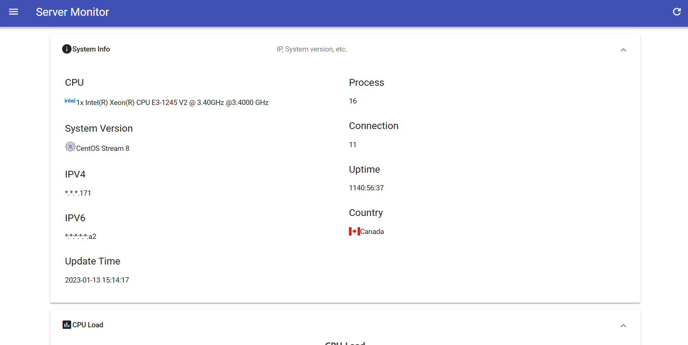
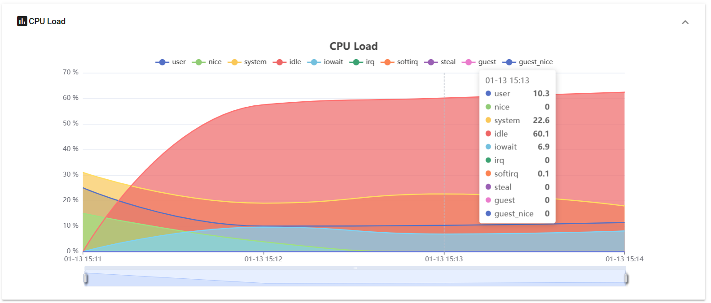
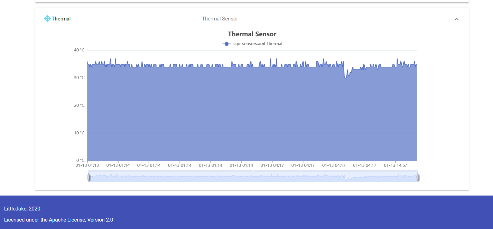

Server Monitor
==========


基于ThinkPHP5.1的服务器监控平台，需要配合服务端python脚本，使用Redis存储相关数据。

### 使用

#### 安装

```bash
git clone https://github.com/LittleJake/server-monitor
cd server-monitor
composer install
cp .env.example .env
```

#### 上报节点密钥操作（增/删/查）

```bash
php think token help
```

#### 配置Redis数据源

```bash
vim .env
```

#### 刷新数据源缓存（加速网站访问）

```bash
php think refresh:cache
```

### 界面演示







### Demo

[测试网站](https://monitor.littlejake.net)

### 开源协议

[Apache 2.0](LICENSE)

### 鸣谢

MDUI

ThinkPHP

ipapi.co
