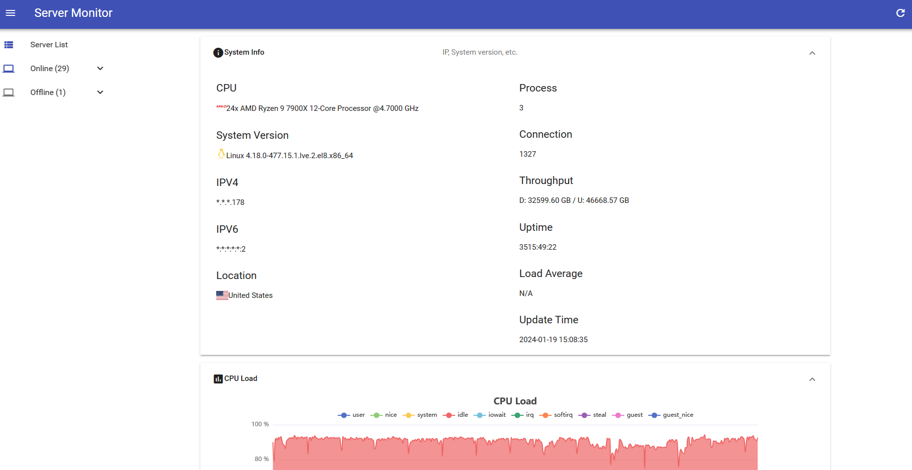

Server Monitor
==========

 


基于ThinkPHP5.1的服务器监控平台，需要配合服务端python脚本，使用Redis存储相关数据。

### 使用

#### 安装

```bash
git clone https://github.com/LittleJake/server-monitor
cd server-monitor
composer install
cp .env.example .env
```

#### API上报节点密钥操作（增/删/查）（TODO）

```bash
php think token help
```

#### 配置Redis数据源

```bash
vim .env
```

#### 刷新数据缓存

```bash
php think refresh:cache
```

### 界面演示





### Demo

[Demo](https://monitor.littlejake.net)

### 数据结构

#### Collection

```json
{
    "Disk": {
        // Based on different mountpoint.
        "mountpoint": {
            "total": "0.00",
            "used": "0.00",
            "free": "0.00",
            "percent": 0
        },
    },
    "Memory": {
        "Mem": {
            "total": "0.00",
            "used": "0.00",
            "free": "0.00",
            "percent": 0.0
        },
        "Swap": {
            "total": "0.00",
            "used": "0.00",
            "free": "0.00",
            "percent": 0.0
        }
    },
    "Load": {
        // Metrics based on platform.
        "metric": 0.0
    },
    "Network": {
        "RX": {
            "bytes": 0,
            "packets": 0
        },
        "TX": {
            "bytes": 0,
            "packets": 0
        }
    },
    "Thermal": {
        // Celsius
        "sensor": 0.0,
    },
    "Battery": {
        "percent": 0.0,
    }
}
```

#### Info

```json
{
    "CPU": "",
    "System Version": "",
    "IPV4": "masked ipv4",
    "IPV6": "masked ipv6",
    "Uptime": "time in readable form",
    "Connection": "",
    "Process": "",
    "Load Average": "",
    "Update Time": "",
    "Country": "extract from ip-api.com",
    "Country Code": "extract from ip-api.com",
    "Throughput": "Gigabytes",
}
```

### 开源协议

[Apache 2.0](LICENSE)

### 鸣谢

[MDUI](https://mdui.org)

[ThinkPHP](https://www.thinkphp.cn/)

[ip-api.com](https://ip-api.com)

### Sponsors

Thanks for the amazing VM server provided by [DartNode](https://dartnode.com?via=1).

 <a href="https://dartnode.com?via=1"></a>

Thanks for the open source project license provided by [JetBrains](https://www.jetbrains.com/).

 <a href="https://www.jetbrains.com/"></a>


